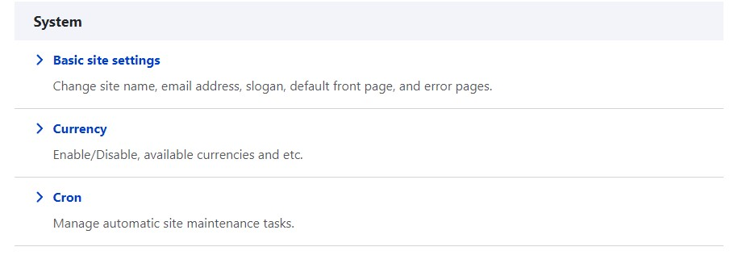
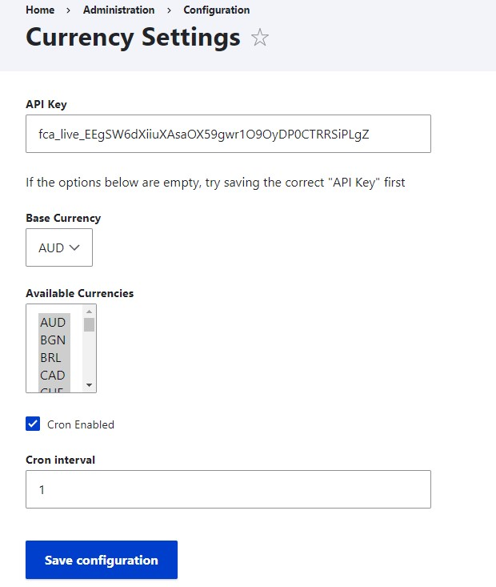
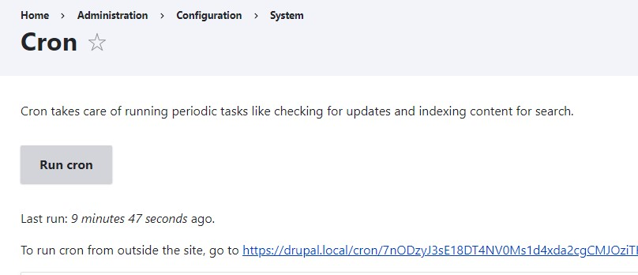
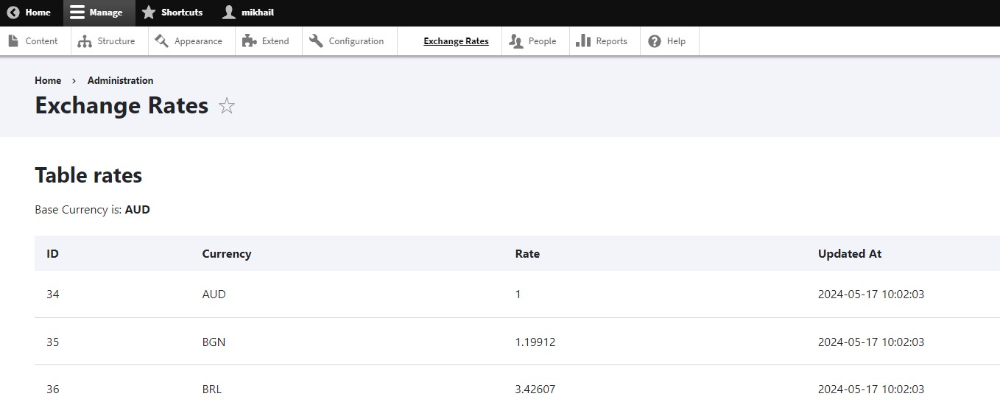

# Test Task

## Installation

Require `korolchukmikhail/currency` using composer.

## Usage

After installation:

Go to Configuration and save API KEY, Base Currency, etc.



Run Cron job:


Via Toolbar go to Exchange Rates page:


You can use CurrencyInterface for work with currency data, examples:
```php
/** @var \Drupal\currency\Api\CurrencyInterface $currencyModel**/
$currencyModel = \Drupal::service('currency.currency')

// get available currencies
$currencies = $currencyModel->getAvailableCurrencies();

// get available rates
$rates = $currencyModel->getAvailableRates();

// convert price, If the requested rate is unavailable, you will get an exception.
// second argument can be missed, value of Base Currency will be got from Settings
$convertedPrice = $currencyModel->convert(100, 'EUR', 'USD');
```
